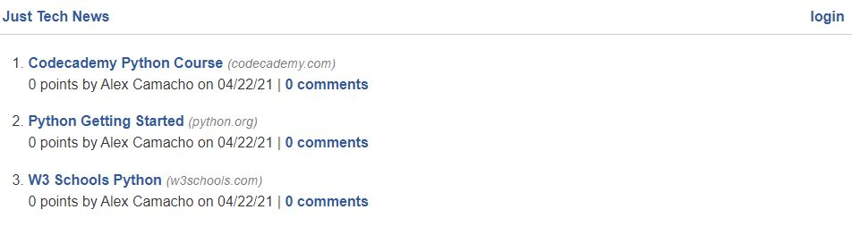
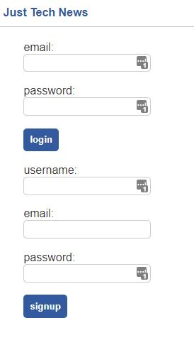
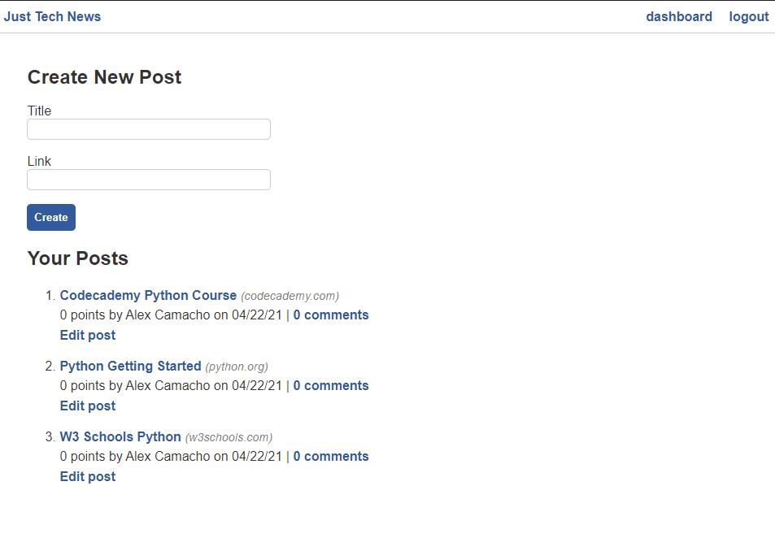
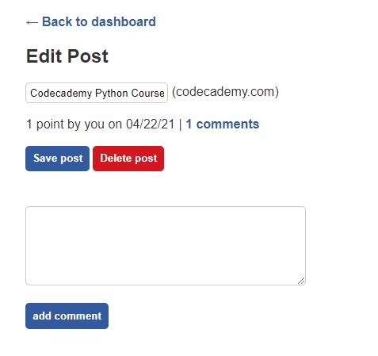
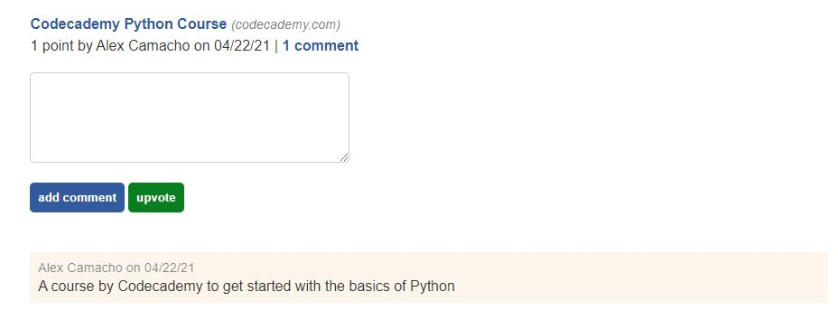

# [Python Newsfeed](https://quiet-tor-56602.herokuapp.com/)


## Description
This project was an experiment in converting a Node.js/Express backend into a Python/Flask back end. Users are able to create accounts to log in and interact with the site. The user will be able to see Posts that are made by other users on the homepage, they can also comment and upvote these posts. New posts are also able to be created, edited, and deleted.

## Table of Contents
- [Installation](#installation)        
- [Usage](#usage)           

- [Contributing](#contributing)
- [Tests](#tests)
- [Questions?](#questions)
           
## Installation
Enter the following command into the command line to install dependencies: ```This app is deployed to Heroku, the dependencies are taken care of on the live site.```

## Usage
The site can be accessed using the live link [here!](https://quiet-tor-56602.herokuapp.com/)

When the site is first loaded the user will be shown the homepage, which will have a list of posts contributed by other users.


If the `login` button is clicked the user will be redirected to the login page. Here they will be able to log in using an existing account or create a new one.

 

After logging on the user will be redirected to their dashboard. Here they will see a list of their posts and be given the option to create a new post, or edit one of their old posts. Any newly created posts will refresh and show on the list below, with the newest post showing first.



If the user chooses to edit a post they will be shown the page below. Here they are given the option to change the title of the post, as well as delete the post entirely. A comment can also be added to the post from this page.



However, the add comment button from the previous example only works on the user's own posts. If the user returns to the home page and clicks on the comment button next to any post, they will be redirected to the comment page.


 Here they will be able to add comments to the posts as well as leave an upvote.


## Contributing
I can be contacted at the information below, or submit a pull request.

## Tests
Enter the following command into the command line to test: ```None, this project does not have any tests.```
           
## Questions?

View more of my work at the Github link below or contact me at the email below.

Github: [alexander-camacho](https://github.com/alexander-camacho)

Email: alsbrain@optonline.net